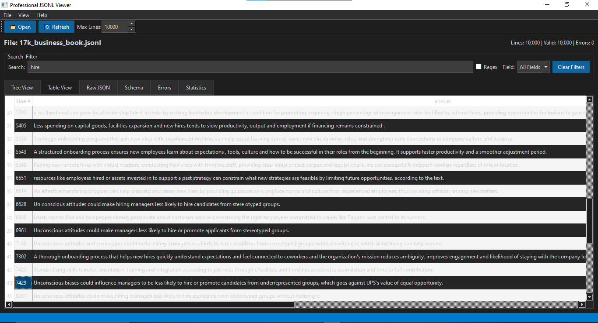

# 🚀 Professional JSONL Dataset Viewer - Fast, Free & Feature-Rich

[](https://www.python.org/)
[](https://pypi.org/project/PyQt6/)
[](LICENSE)
[](https://github.com/xx77yy/jsonl-viewer)

> **The Ultimate JSONL File Viewer & Dataset Explorer** - View, analyze, search, and export large JSONL datasets with ease. Perfect for AI/ML datasets, log files, data scientists, and developers.



## 📊 What is JSONL Format?

**JSONL** (JSON Lines) is a popular format for storing structured data where each line is a valid JSON object. It's widely used for:
- 🤖 **Machine Learning Datasets** (Training data, LLM datasets, AI model inputs)
- 📝 **Large Language Model (LLM) Data** (ChatGPT datasets, prompt datasets, fine-tuning data)
- 📊 **Big Data Processing** (Streaming data, ETL pipelines, data warehousing)
- 🔍 **Log Files** (Application logs, API logs, server logs)
- 💾 **Data Export/Import** (Database dumps, API responses, data migration)
- 🧪 **Data Science Projects** (Pandas datasets, exploratory data analysis)

---

## ⚡ Why Choose This JSONL Viewer?

### 🎯 **Key Features**

#### **🚄 High Performance**
- ✅ **Stream Large Files** - Handle GB-sized JSONL files without memory issues
- ✅ **Incremental Loading** - Line-by-line processing for instant results
- ✅ **Multi-threaded** - Background loading keeps UI responsive
- ✅ **Memory Efficient** - Optimized for big data datasets
- ✅ **Fast Search** - Real-time filtering across millions of records

#### **📁 File Format Support**
- ✅ **JSONL Files** (`.jsonl`)
- ✅ **Compressed JSONL** (`.jsonl.gz`, gzip compression)
- ✅ **Newline Delimited JSON** (`.ndjson`)
- ✅ **JSON Lines** - Standard format support
- ✅ **Auto-detection** - Smart format recognition

#### **🔍 Advanced Search & Filter**
- ✅ **Text Search** - Fast full-text search across all fields
- ✅ **Regex Search** - Powerful pattern matching
- ✅ **Field-Specific Filter** - Search within specific JSON keys
- ✅ **Highlight Matches** - Visual search result highlighting
- ✅ **Case-Insensitive** - Flexible search options

#### **📊 Multiple View Modes**
1. **Tree View** - Hierarchical JSON structure with line numbers
2. **Table View** - Spreadsheet-style data grid with sorting
3. **Raw JSON View** - Syntax-highlighted JSON with color coding
4. **Schema View** - Auto-detected data structure analysis
5. **Error View** - Parse errors and malformed JSON tracking
6. **Statistics View** - Comprehensive dataset analytics

#### **🧠 Smart Data Intelligence**
- ✅ **Automatic Schema Detection** - Discover all JSON fields
- ✅ **Type Analysis** - Track data types for each field
- ✅ **Field Coverage Stats** - See field presence across records
- ✅ **Data Quality Metrics** - Missing values, error rates
- ✅ **Record Statistics** - Count, validation, success rates

#### **💾 Export Capabilities**
- ✅ **Export Filtered JSONL** - Save search results as JSONL
- ✅ **Export to CSV** - Convert JSON to spreadsheet format
- ✅ **Export to Excel** - Excel-compatible output
- ✅ **Batch Export** - Process multiple files
- ✅ **Data Sampling** - Extract random samples

#### **🎨 Professional UI/UX**
- ✅ **Dark Theme** - Easy on the eyes (VS Code style)
- ✅ **Light Theme** - Classic professional look
- ✅ **Syntax Highlighting** - Color-coded JSON for readability
- ✅ **Keyboard Shortcuts** - Power user productivity
- ✅ **Responsive Design** - Smooth scrolling and interaction

---

## 🛠️ Installation

### **Prerequisites**
- Python 3.8 or higher
- pip package manager

### **Quick Install**

```bash
# Clone the repository
git clone https://github.com/xx77yy/jsonl-viewer.git
cd jsonl-viewer

# Install dependencies
pip install -r requirements.txt

# Run the application
python jsonl_viewer.py
```

### **Install via pip** (Coming Soon)
```bash
pip install jsonl-dataset-viewer
```

---

## 🚀 Quick Start Guide

### **1. Launch the Application**
```bash
python jsonl_viewer.py

# Or open a file directly
python jsonl_viewer.py your_dataset.jsonl

# Works with compressed files
python jsonl_viewer.py large_dataset.jsonl.gz
```

### **2. Open Your Dataset**
- Click **📂 Open** button or press `Ctrl+O`
- Select your `.jsonl` or `.jsonl.gz` file
- Watch as the viewer loads your data incrementally

### **3. Explore Your Data**
- **Switch Views**: Use tabs to change between Tree, Table, Raw, Schema views
- **Search**: Type in the search box for instant filtering
- **Filter by Field**: Select a specific field from the dropdown
- **Sort**: Click column headers in Table view to sort data

### **4. Export Results**
- **Filtered Data**: `Ctrl+E` to export search results
- **CSV Format**: File → Export to CSV
- **Original Format**: Save as JSONL

---

## 📖 Use Cases & Examples

### **🤖 Machine Learning & AI**

**Use Case 1: LLM Training Data Inspection**
```jsonl
{"prompt": "What is Python?", "completion": "Python is a programming language.", "tokens": 45}
{"prompt": "Explain ML", "completion": "Machine learning is a subset of AI.", "tokens": 52}
```
✅ Perfect for viewing ChatGPT datasets, prompt engineering, fine-tuning data

**Use Case 2: Image Dataset Metadata**
```jsonl
{"image_id": "001", "labels": ["cat", "animal"], "width": 1920, "height": 1080, "annotator": "user1"}
{"image_id": "002", "labels": ["dog", "pet"], "width": 1280, "height": 720, "annotator": "user2"}
```
✅ Ideal for computer vision datasets, COCO format, image annotations

### **📊 Data Science & Analytics**

**Use Case 3: Customer Data Analysis**
```jsonl
{"customer_id": 101, "age": 25, "purchases": 12, "total_spent": 450.00, "region": "US"}
{"customer_id": 102, "age": 34, "purchases": 8, "total_spent": 320.00, "region": "EU"}
```
✅ Analyze customer behavior, sales data, e-commerce datasets

**Use Case 4: Log File Analysis**
```jsonl
{"timestamp": "2025-01-01T10:00:00Z", "level": "ERROR", "service": "api", "message": "Timeout"}
{"timestamp": "2025-01-01T10:01:00Z", "level": "INFO", "service": "web", "message": "Request OK"}
```
✅ Debug applications, monitor systems, analyze API logs

### **🔬 Research & Academia**

**Use Case 5: Scientific Data**
```jsonl
{"experiment_id": "exp_001", "temperature": 25.5, "pressure": 101.3, "result": "success"}
{"experiment_id": "exp_002", "temperature": 30.0, "pressure": 100.8, "result": "failed"}
```
✅ Lab data, research datasets, experimental results

---

## ⌨️ Keyboard Shortcuts

| Shortcut | Action |
|----------|--------|
| `Ctrl+O` | Open JSONL file |
| `Ctrl+E` | Export filtered data |
| `Ctrl+Q` | Quit application |
| `F5` | Refresh all views |
| `Ctrl+F` | Focus search box (coming soon) |

---

## 🎯 Advanced Features

### **Schema Detection**
Automatically discovers and analyzes your dataset structure:
- All JSON fields/keys
- Data types per field (string, number, boolean, object, array)
- Field coverage (% of records containing each field)
- Nested structure analysis

### **Error Handling**
Robust parsing with comprehensive error tracking:
- Invalid JSON line detection
- Parse error reporting with line numbers
- Malformed data visualization
- Error statistics and patterns

### **Performance Optimization**
Built for speed and efficiency:
- Lazy loading for instant startup
- Virtualized rendering for smooth scrolling
- Efficient memory management
- Background processing
- Configurable line limits (10K, 100K, 1M+ records)

---

## 🔧 Configuration

### **Max Lines Setting**
Control how many records to load:
```python
# In the toolbar
Max Lines: [10000] ▼
# Options: 1K, 10K, 100K, 1M, or All
```

### **Search Options**
- **Text Search**: Simple substring matching
- **Regex Mode**: Enable advanced pattern matching
- **Field Filter**: Narrow search to specific fields

---

## 📦 Dataset Examples

### **Where to Find JSONL Datasets?**

1. **Hugging Face Datasets** - https://huggingface.co/datasets
   - LLM training data, NLP datasets, multimodal data

2. **Kaggle** - https://kaggle.com/datasets
   - Competition datasets, ML datasets, open data

3. **OpenAI** - https://platform.openai.com/docs
   - Fine-tuning datasets, prompt examples

4. **Google Dataset Search** - https://datasetsearch.research.google.com
   - Academic datasets, research data

5. **GitHub Awesome Lists** - Search "awesome-datasets"
   - Curated dataset collections

---

## 🤝 Contributing

We welcome contributions! Here's how:

1. **Fork** the repository
2. **Create** a feature branch (`git checkout -b feature/AmazingFeature`)
3. **Commit** your changes (`git commit -m 'Add AmazingFeature'`)
4. **Push** to the branch (`git push origin feature/AmazingFeature`)
5. **Open** a Pull Request

### **Feature Requests**
Have an idea? Open an issue with the `enhancement` label!

---

## 🐛 Bug Reports

Found a bug? Please open an issue with:
- JSONL file sample (if possible)
- Steps to reproduce
- Expected vs actual behavior
- Screenshots (if applicable)

---

## 📚 Technical Details

### **Architecture**
- **Frontend**: PyQt6 (cross-platform GUI)
- **Parser**: Native Python JSON (fast & reliable)
- **Threading**: QThread for background processing
- **Compression**: gzip library for .gz support
- **Highlighting**: Pygments-based syntax coloring

### **Supported Platforms**
- ✅ Windows 10/11
- ✅ macOS 10.14+
- ✅ Linux (Ubuntu, Fedora, Arch, etc.)

### **Requirements**
```txt
Python >= 3.8
PyQt6 >= 6.0
pygments >= 2.0
```

---

## 🏆 Comparison with Other Tools

| Feature | This Viewer | VSCode | Pandas | cat/less |
|---------|-------------|--------|---------|----------|
| GUI | ✅ | ✅ | ❌ | ❌ |
| Large Files | ✅ | ⚠️ | ❌ | ✅ |
| Search | ✅ | ✅ | ✅ | ⚠️ |
| Schema Detection | ✅ | ❌ | ⚠️ | ❌ |
| Export | ✅ | ❌ | ✅ | ❌ |
| Table View | ✅ | ❌ | ✅ | ❌ |
| Free | ✅ | ✅ | ✅ | ✅ |
| Offline | ✅ | ✅ | ✅ | ✅ |

---

## 📄 License

This project is licensed under the **MIT License** - see the [LICENSE](LICENSE) file for details.

---

## 🌟 Star History

If you find this tool useful, please consider giving it a ⭐ on GitHub!

---

## 📞 Support & Community

- **GitHub Issues**: Bug reports and feature requests
- **Discussions**: Questions and community support
- **Email**: support@yourproject.com (coming soon)

---

## 🔗 Related Projects

- [jq](https://stedolan.github.io/jq/) - Command-line JSON processor
- [jsonlint](https://github.com/zaach/jsonlint) - JSON validator
- [ndjson-cli](https://github.com/mbostock/ndjson-cli) - Command-line tools for NDJSON

---

## 🎓 Learning Resources

### **JSONL Format Tutorials**
- [JSON Lines Format Specification](http://jsonlines.org/)
- [Working with JSONL in Python](https://realpython.com/python-json/)
- [JSONL Best Practices](https://jsonlines.readthedocs.io/)

### **Dataset Preparation**
- [Creating Training Datasets for ML](https://developers.google.com/machine-learning/data-prep)
- [Data Format Conversion Guide](https://pandas.pydata.org/docs/)

---

## 📈 Roadmap

### **Coming Soon**
- [ ] Real-time file monitoring (watch mode)
- [ ] Advanced statistics (histograms, charts)
- [ ] Column-based filtering
- [ ] Custom export templates
- [ ] Plugins/Extensions system
- [ ] Diff mode (compare two JSONL files)
- [ ] Data validation rules
- [ ] Batch processing multiple files
- [ ] Cloud storage integration (S3, GCS)
- [ ] REST API for programmatic access

### **Future Enhancements**
- [ ] Parquet format support
- [ ] Apache Avro support
- [ ] SQL query interface
- [ ] Data transformation tools
- [ ] Collaborative annotations
- [ ] Version control integration

---

## 💡 Tips & Tricks

### **Performance Tips**
1. **Use Max Lines limit** for initial exploration of huge files
2. **Enable filtering** before loading to reduce memory usage
3. **Close unused tabs** to free up resources
4. **Use compressed .gz files** for faster loading

### **Search Tips**
1. **Regex for complex patterns**: `"email":\s*".*@gmail\.com"`
2. **Field-specific search**: Select field first, then search
3. **Case sensitivity**: Use regex with `(?i)` for case-insensitive

### **Export Tips**
1. **Filter first, then export** to save disk space
2. **CSV export** for Excel/Google Sheets compatibility
3. **Sample random records** for testing before full export

---

## 🙏 Acknowledgments

- PyQt6 team for the excellent GUI framework
- Python community for amazing libraries
- All contributors and users of this project

---

## 📊 Usage Statistics

- **Downloads**: Coming Soon
- **GitHub Stars**: Give us a ⭐
- **Active Users**: Join our community!

---

**Made with ❤️ for Data Scientists, ML Engineers, and Developers worldwide**

### Keywords
JSONL viewer, JSON Lines viewer, dataset viewer, JSONL file reader, JSON dataset tool, NDJSON viewer, data science tools, ML dataset viewer, AI training data viewer, LLM dataset viewer, ChatGPT dataset viewer, large file viewer, big data viewer, log file viewer, JSON parser, JSONL explorer, data analysis tool, Python JSONL viewer, free JSONL viewer, open source dataset viewer, machine learning tools, data visualization, ETL tools, data quality tools, schema detector, JSON schema viewer
